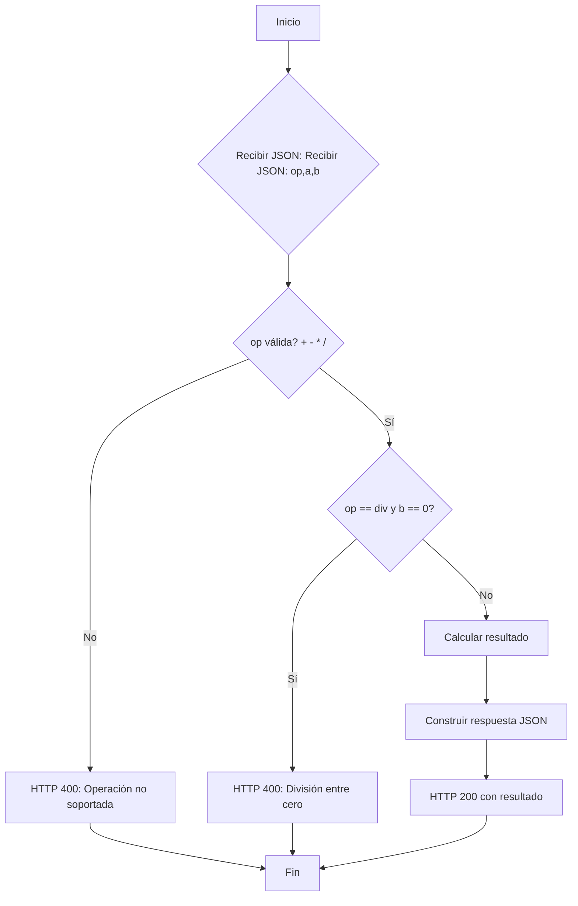

```mermaid
graph TD;
    A[Inicio] --> B{Recibir JSON: Recibir JSON: op,a,b}
    B --> C{op válida? + - * /}
    C -- No --> E[HTTP 400: Operación no soportada] --> F[Fin]
    C -- Sí --> D{op == div y b == 0?}
    D -- Sí --> G[HTTP 400: División entre cero] --> F
    D -- No --> H[Calcular resultado]
    H --> I[Construir respuesta JSON]
    I --> J[HTTP 200 con resultado]
    J --> F
```
